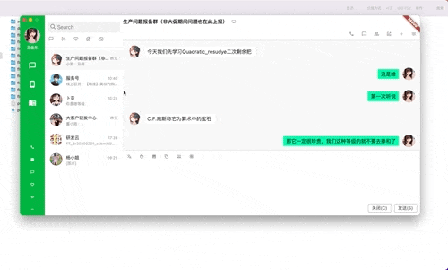
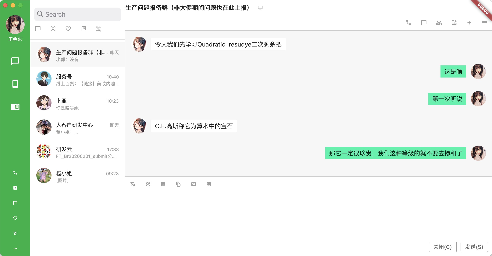

# flutter_wechat_desktop

桌面版微信，适合企业内部开发桌面版的沟通工具，目前项目只在macos跑过，其他操作系统可自行配置

## Getting Started







**使用的组件：**

自研ResizeWidget 组件：内部区域使用MouseRegion识别鼠标，然后GestureDetector的pan手势进行大小拖拽

第三方bitsdojo_window组件：可对窗口进行最大最小设置，设置window风格等，可参照swift代码中的NSWindow


**开发环境**

```
[✓] Flutter (Channel unknown, 2.0.6, on macOS 12.0 21A5543b darwin-x64, locale zh-Hans-CN)
    • Flutter version 2.0.6 at /Users/jd/Documents/sdk/flutter/flutter
    • Framework revision 1d9032c7e1 (8 个月前), 2021-04-29 17:37:58 -0700
    • Engine revision 05e680e202
    • Dart version 2.12.3
    • Pub download mirror https://pub.flutter-io.cn
    • Flutter download mirror https://storage.flutter-io.cn


[✓] Xcode - develop for iOS and macOS
    • Xcode at /Applications/Xcode.app/Contents/Developer
    • Xcode 13.0, Build version 13A233
    • CocoaPods version 1.11.2
```

